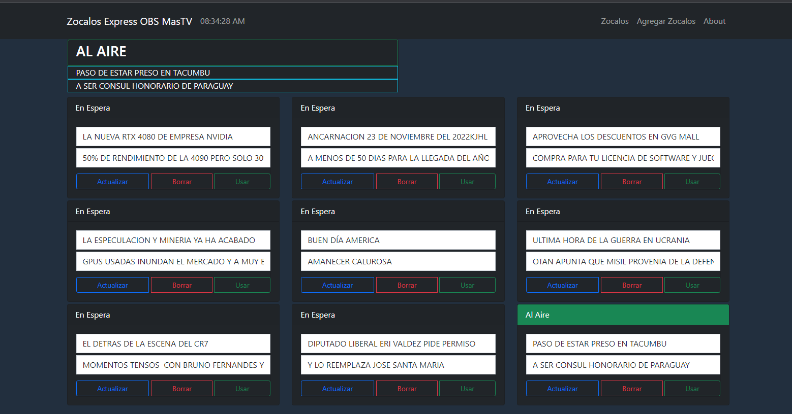

# Express Books

Zocalos Express es una Aplicacion Web para guardar y listar textos de tipo lowerthird para OBS Studio. 
La lista de datos se guardan en formato JSON y cuando se elije uno para usar se guarda un par en Formato TXT.

# ScreenShoot



# Installation

```shell
git clone https://github.com/FaztTech/books-express
npm install
npm run build
npm start
```

# Environment Variables

- `PORT`, this is the http port of the server. by default is `5000`.
- `APPID` - (optional), this is an unique ID for the application to identify in a load balancer

Also you can create a .env file with the environment variables mentioned above.

# Docker

```shell
docker build -t zocalo-express .
```

```shell
docker run -p 80:5000 zocalo-express .
```

then visit: `http://localhost`

# Considerations

- Make sure nodemon ignores the file `src/zocalos.json`.

## Reference

- https://babeljs.io/docs/en/babel-plugin-transform-runtime

### Todo

- [ ] Add user authentication
- [ ] Allow to download the json data
- [ ] Publish a docker container image on dockerhub
- [x] Change to dark theme
